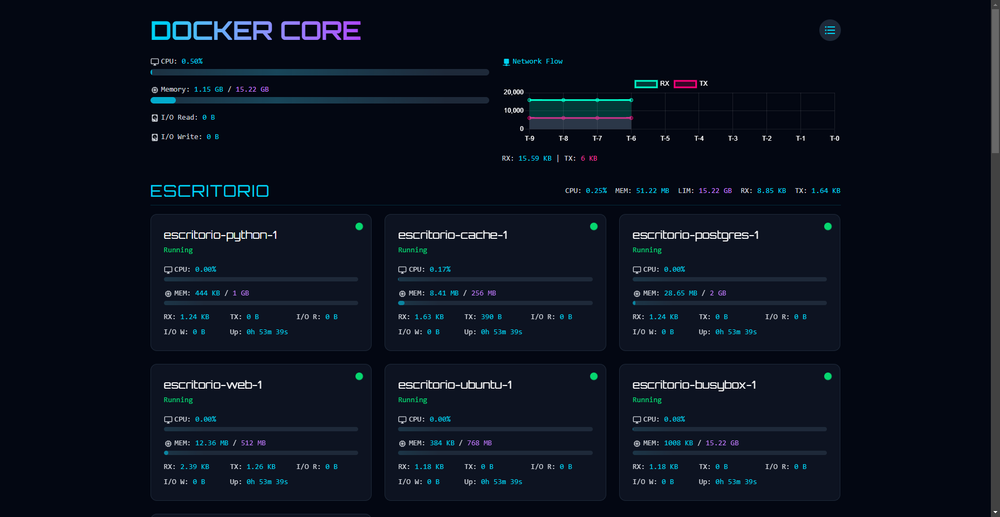
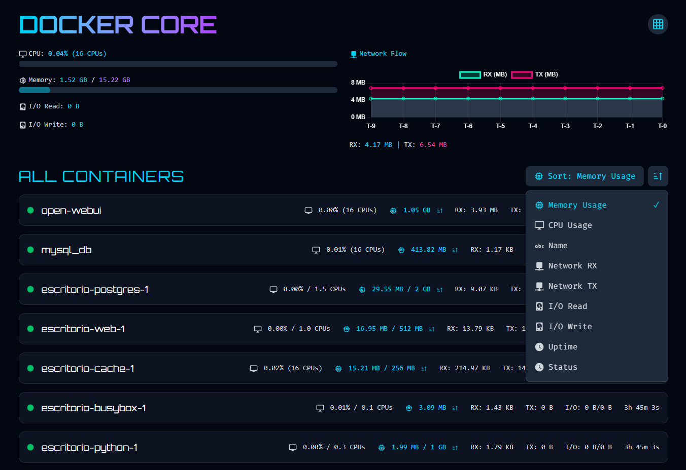

# Docker Core Monitor

A real-time Docker container monitoring dashboard built with SvelteKit, Socket.IO, and Python.



## Features

- Real-time container stats monitoring
- CPU, Memory, Network, and I/O metrics
- Group view and List view modes
- Beautiful UI with animations and gradients
- Responsive design

## List View


## Quick Start

### Using Docker Compose (Recommended)

```bash
# Clone the repository
git clone https://github.com/matifanger/docker-core-monitor.git
cd docker-core-monitor

# Start the application
docker compose up -d

# To stop the application
docker compose down
```

Visit `http://localhost:4173` in your browser to access the frontend.

### Manual Setup

1. Install dependencies:
```bash
# Backend
cd backend
pip install -r requirements.txt

# Frontend
cd frontend
pnpm install
```

2. Configure environment:
Copy `.env.example` to `.env` and adjust values if needed:
```bash
cp .env.example .env
```

3. Run development servers:
```bash
# Backend (in project root)
python app.py

# Frontend (in frontend directory)
cd frontend
pnpm dev
```

4. For production:
```bash
# Frontend
cd frontend
pnpm build
pnpm preview
```

## Environment Variables

- `PUBLIC_API_URL`: Backend API URL (default: http://localhost:5000)
- `PUBLIC_SOCKET_URL`: WebSocket server URL (default: http://localhost:5000)
- `PUBLIC_REFRESH_INTERVAL`: Container list refresh interval in ms (default: 10000)

## Project Structure

- `frontend/`: SvelteKit application
- `backend/`: Python backend server
- `Dockerfile.backend`: Backend Docker configuration
- `frontend/Dockerfile.frontend`: Frontend Docker configuration
- `docker-compose.yml`: Docker Compose configuration

## Requirements

- Docker and Docker Compose (for containerized setup)
- Node.js 16+ and pnpm (for manual frontend setup)
- Python 3.8+ (for manual backend setup)
- Docker socket access (when running outside Docker) 

## To-Do
- [ ] Fix container renaming – Right now, if a named container restarts, its ID changes. Need a better way to keep the rename.
- [ ] Allow same names for different apps – Make sure apps can share names without breaking things.
- [ ] Create a prebuilt Docker image – So pulling is faster and smoother.
- [ ] Add user authentication – Basic user/password login.
- [ ] Add app controls – Start, Restart, and Stop buttons for apps and container groups.