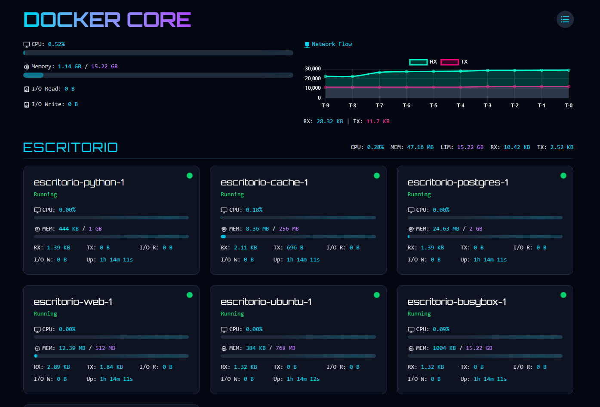

# Docker Core Monitor

A real-time Docker container monitoring dashboard built with SvelteKit and Socket.IO.



## Features

- Real-time container stats monitoring
- CPU, Memory, Network, and I/O metrics
- Group view and List view modes
- Beautiful UI with animations and gradients
- Responsive design

## Quick Start

### Using Docker

```bash
# Build and run the container
docker build -t docker-core-monitor .
docker run -p 5000:5000 -v /var/run/docker.sock:/var/run/docker.sock docker-core-monitor
```

Visit `http://localhost:5000` in your browser.

### Manual Setup

1. Install dependencies:
```bash
pnpm install
```

2. Configure environment:
Copy `.env.example` to `.env` and adjust values if needed:
```bash
cp .env.example .env
```

3. Run development server:
```bash
pnpm dev
```

4. For production:
```bash
pnpm build
pnpm preview
```

## Environment Variables

- `PUBLIC_API_URL`: Backend API URL (default: http://localhost:5000)
- `PUBLIC_SOCKET_URL`: WebSocket server URL (default: http://localhost:5000)
- `PUBLIC_REFRESH_INTERVAL`: Container list refresh interval in ms (default: 10000)

## Requirements

- Node.js 16+
- Docker (for monitoring containers)
- Docker socket access (when running outside Docker) 